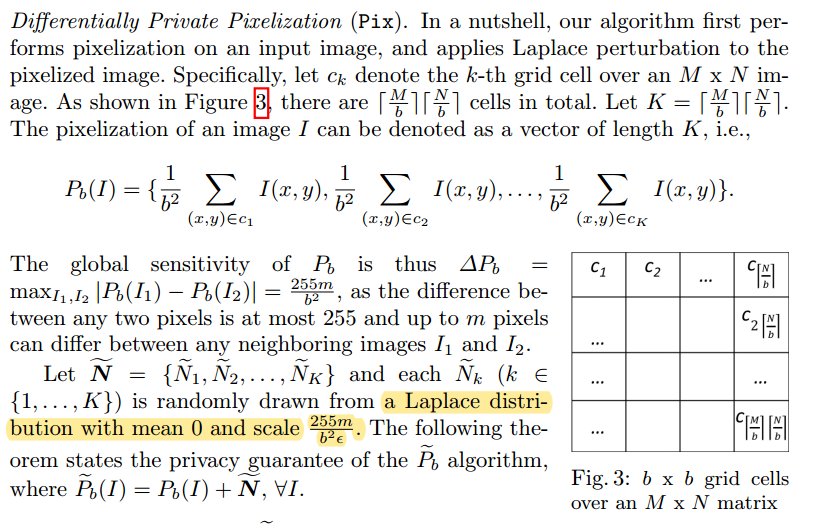
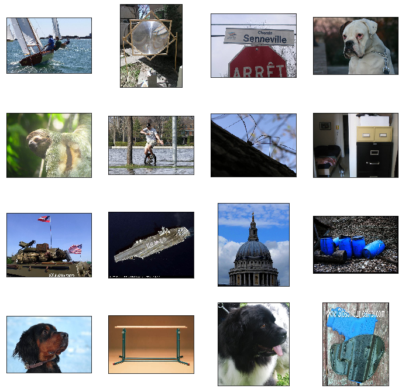
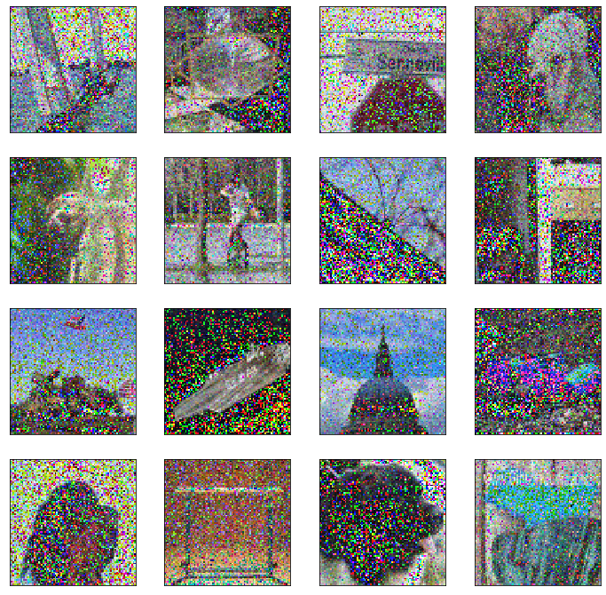

# Fan (2018) Image Pixelization with Differential Privacy

[Paper](https://link.springer.com/chapter/10.1007/978-3-319-95729-6_10)



# Implementation


```python
import image_util as iu
import numpy as np
```


```python
def add_laplace_noise(px_img, f_w, f_h, m=200, eps=0.01):
    """
    Input:
        px_img: pixelated image
        f_w, f_h: width and height of the window used for pixelation
        mean: mean for laplace noise
        eps: privacy parameter
        m: number of pixels to add noise to (see paper)
    Output:
        Return laplace pertubated image
    """
    scale = (255 * m) / (f_w * f_h * eps)
    noise = np.random.laplace(loc=0,scale=scale, size=px_img.shape)
    noisy_image = np.array(px_img + noise)
    return noisy_image
```


```python
def pixelate(img, target_w, target_h, f_w, f_h):
    """
    Input: 
        img: numpy array for image
        target_w: required width of the pixelated image
        target_h: required height of the pixelated image
        f_w, f_h: width and height of the window used for pixelation
    Output:
        Returns pixelated image with dimenstion (target_h, target_w, input_channels)
    """
    
    if len(img.shape) == 2:
        img = np.expand_dims(img, axis=2)
    
    ch = img.shape[2]
    
    px = np.zeros((target_h, target_w, ch))
    for i in range(target_h):
        row = i * f_h
        for j in range(target_w):
            col = j * f_w
            grid = img[row : row + f_h, col : col + f_w]
            m = np.mean(grid, axis=(0,1))
            px[i,j,:] = m
    return px
```


```python
def dp_pixelate(I, target_w, target_h, m, eps):
    """
    Input:
        I: Pillow image object
        target_w: required width of the pixelated image
        target_h: required height of the pixelated image
        eps: privacy parameter
        m: number of pixels to add noise to (see paper)
    Output:
        Return DP pixelated Pillow image with dimenstion (target_h, target_w, input_channels)
    """
    
    img = iu.pillow_to_numpy(I)
    
    shape = img.shape
    f_h = shape[0] // (target_h )
    f_w = shape[1] // (target_w )
    
    px_img = pixelate(img, target_w, target_h, f_w, f_h)
    dp_px_img = add_laplace_noise(px_img, f_w, f_h, m, eps)
    dp_px_I = iu.numpy_to_pillow(dp_px_img)
    
    return dp_px_I
```

# ImageNet Dataset

## Lets load some random images from the dataset


```python
iu.set_dataset('miniimagenet')
image_paths = set([iu.get_random_image(iu.data_dir) for i in range(16)])
images = list(map(iu.load_image, image_paths))
labels = None
iu.display_image_grid(images, titles=labels)
```





## Set the parameters


```python
target_w = 84
target_h = 84
m = 1
eps = 0.5
```

## DP Pixelated Images!


```python
noisy_images = [dp_pixelate(I, target_w, target_h, m, eps) for I in images]
iu.display_image_grid(noisy_images, titles=labels)
```





# Questions?

- How to quantify the parameter m?
- What value should be used for eps?


# Citation

    @inproceedings{10.1007/978-3-319-95729-6_10,
        title        = {Image Pixelization with Differential Privacy},
        author       = {Fan, Liyue},
        year         = 2018,
        booktitle    = {Data and Applications Security and Privacy XXXII},
        publisher    = {Springer International Publishing},
        address      = {Cham},
        pages        = {148--162},
        isbn         = {978-3-319-95729-6},
        editor       = {Kerschbaum, Florian and Paraboschi, Stefano},
    }

